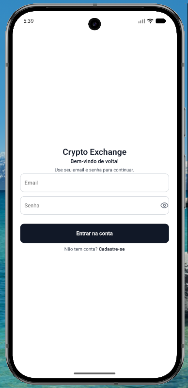
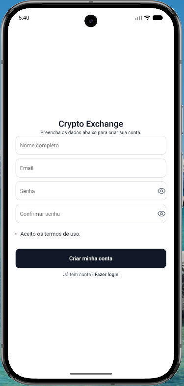
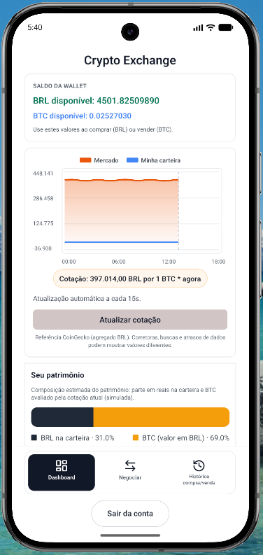
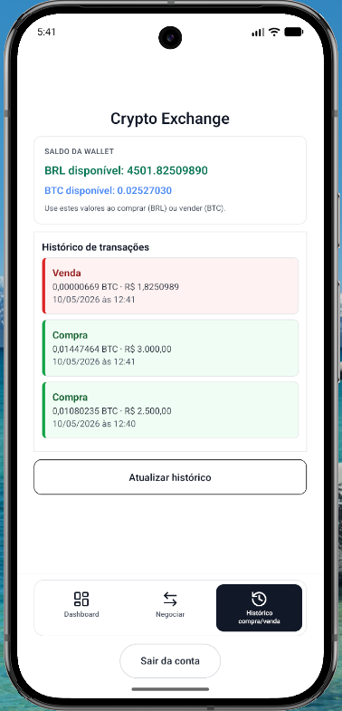
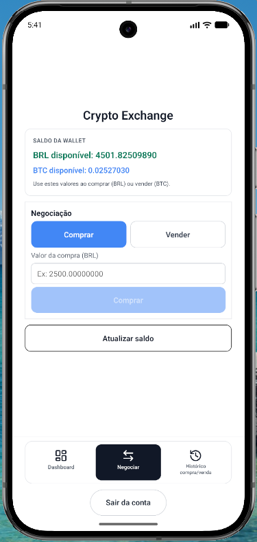
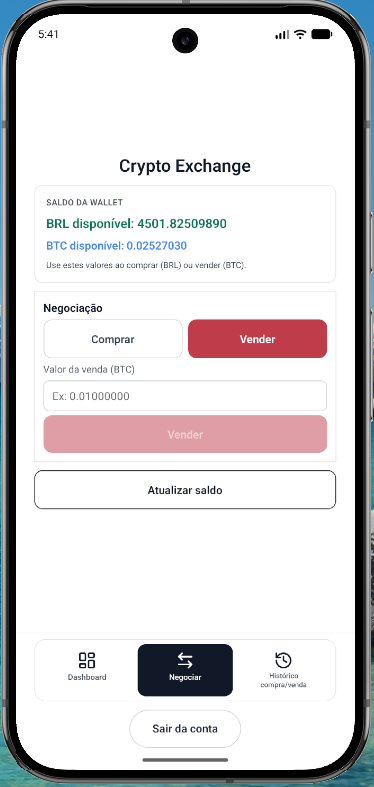

# Crypto Exchange

Plataforma de trading (mini Binance) com backend em Laravel e aplicativo mobile em React Native.

## Documentacao por area

| Area | README | Conteudo principal |
|------|--------|-------------------|
| **Raiz** | `README.md` | Objetivo, stack, guia Docker/Sail, **arquitetura**, **diferenciais**, secao **decimal(16,8) e concorrencia**, **Swagger + cURL**, status, scripts |
| **Backend** | [`backend/README.md`](backend/README.md) | Versoes PHP/Laravel/Sanctum, **status Fases 1–3**, tabela de rotas `/api`, Sail, testes, OpenAPI |
| **Frontend (mobile)** | [`mobile/README.md`](mobile/README.md) | Versoes Expo/RN/NativeWind, **Expo Router (SDK 54)**, **status Fase 4**, Axios, troubleshooting |

O bloco **Objetivo do teste tecnico** (abaixo) e intencionalmente **so na raiz** — nao repete-se em `backend/README.md` nem em `mobile/README.md`.

## Screenshots do app mobile

Imagens para documentacao no GitHub / leitura do monorepo. Ficheiros em [`mobile/src/assets/screenshots/`](mobile/src/assets/screenshots/) (codigo-fonte do app; uso principal aqui no README, sem ligacao aos assets nativos gerados pelo Expo em build).

| Login | Registo |
|:---:|:---:|
|  |  |
| **Dashboard** | **Histórico** |
|  |  |
| **Negociar — Comprar** | **Negociar — Vender** |
|  |  |

## Objetivo do teste tecnico

Entregar uma aplicacao simples de compra e venda de BTC com:

- autenticacao de usuario;
- carteira com saldo em BRL e BTC;
- preco fake dinamico do mercado;
- operacoes de compra e venda;
- historico de transacoes;
- documentacao clara e testes automatizados.

## Stack do projeto (versoes)

Resumo alinhado a `backend/composer.json` e `mobile/package.json`. Detalhes e comandos por pacote nos READMEs linkados acima.

| Camada | Tecnologias principais |
|--------|------------------------|
| **Backend** | PHP ^8.3, Laravel ^13, Sanctum ^4, Sail ^1.58, MySQL, Redis, PHPUnit ^12.5, L5-Swagger ^11 |
| **Mobile** | Expo SDK ~54, **Expo Router ~6**, React 19.1, React Native 0.81, TypeScript ~5.9, NativeWind ^4, Tailwind ^3.4, Axios ^1.16, date-fns ^4.1 |
| **Testes (API)** | PHPUnit (Feature e Unit) |

## Arquitetura: consistencia no trade

Compra e venda atualizam **saldos** (`wallets`) e gravam **historico** (`transactions`). Para nao haver estado inconsistente (ex.: debito sem registo), o motor usa:

1. **`DB::transaction(...)`** — toda a operacao roda dentro de uma **transacao de banco**. Se algo falhar antes do `commit`, o MySQL faz **rollback** e nenhuma alteracao parcial permanece.
2. **`lockForUpdate()`** na linha da carteira do usuario — ao ler `wallets` dentro dessa transacao, a linha fica **bloqueada** ate o fim da operacao. Outra requisicao que tente alterar a mesma carteira **espera** ou ve saldos ja consolidados, reduzindo **double spending** por leitura desatualizada.

Codigo de referencia: [`backend/app/Services/TradeService.php`](backend/app/Services/TradeService.php).

## Diferenciais tecnicos

| Topico | O que foi feito |
|--------|-----------------|
| **Redis (cache de preco)** | O `MarketPriceService` usa a chave de cache **`btc_price`** (TTL curto). Cotacoes repetidas reutilizam o valor em memoria/Redis, alinhando mercado e trade sem gerar preco novo a cada request. |
| **Precisao decimal (8 casas para BTC)** | Migrations com **`decimal(16,8)`** para BRL e BTC em `wallets` e `transactions`. No servico de trade, calculos com **BCMath** (`bcadd`, `bcsub`, `bcdiv`, `bcmul`, `bccomp`) em vez de `float`, evitando erro de representacao binaria em dinheiro e cripto. |

## Por que `decimal(16,8)` para cripto e como a concorrencia foi tratada

### Precisao numerica (`decimal(16,8)`)

Tipos de ponto flutuante (`float` / `double` em PHP) representam numeros em base binaria: valores como `0.1` nao sao exatos, e operacoes repetidas de soma/subtracao acumulam erro — inaceitavel para **saldo**, **quantidade de BTC** e **preco de execucao**.

Por isso o modelo usa colunas **`DECIMAL(16,8)`** no MySQL:

- **16** digitos no total e **8** apos a casa decimal permitem valores grandes o suficiente para BRL e granularidade fina para fracoes de BTC (ate satoshis em escala logica de negocio).
- Os valores sao persistidos e comparados como decimais exatos no banco; na aplicacao, o **`TradeService`** usa **BCMath** para somar, subtrair, multiplicar, dividir e comparar **sem converter para float**, mantendo consistencia com o que esta gravado nas tabelas `wallets` e `transactions`.

### Concorrencia e travas (`lockForUpdate`)

Varias requisicoes HTTP podem chegar ao mesmo tempo tentando debitar a mesma carteira. Sem sincronizacao, duas leituras do mesmo saldo poderiam autorizar duas compras que, somadas, excedem o disponivel (**double spending** por corrida).

A abordagem adotada e **pessimista e explicita no banco**:

1. Cada compra ou venda executa dentro de **`DB::transaction(...)`**, garantindo que atualizacao da wallet e insercao no historico sejam **atomicas**: ou tudo confirma (`commit`) ou nada persiste (`rollback`).
2. Dentro dessa transacao, a linha da carteira do usuario e carregada com **`lockForUpdate()`**. No MySQL (InnoDB), isso bloqueia a linha ate o fim da transacao atual, de forma que outra requisicao que precise da mesma linha **aguarda** e so le os saldos depois que a primeira operacao termina — evitando decisoes de trade com base em saldo **desatualizado**.

O fluxo esta centralizado em **`backend/app/Services/TradeService.php`**, chamado pelo **`TradeController`**. Os testes em **`tests/Feature/TradeTest.php`** cobrem falha por saldo insuficiente (sem alterar wallet nem criar transacao) e sucesso com wallet e `transactions` coerentes.

## Status de implementacao

Checklist **consolidado** (tudo o que foi entregue). O detalhe por area:

- **Backend:** [backend/README.md — Status de implementacao (backend)](backend/README.md#status-de-implementacao-backend)
- **Mobile:** [mobile/README.md — Status de implementacao (mobile)](mobile/README.md#status-de-implementacao-mobile)

### Fase 1 - Execucao inicial

- [x] Projeto criado via `laravel.build`
- [x] Ambiente Docker/Sail configurado
- [x] Containers `laravel.test`, `mysql`, `redis` e `mailpit`
- [x] API scaffolding instalado com `php artisan install:api`

### Fase 2 - Autenticacao

- [x] Registro de usuario (`POST /api/register`)
- [x] Login com email e senha (`POST /api/login`)
- [x] Endpoint protegido `GET /api/me`
- [x] Validacao de aceite de termos no registro (`accepted_terms`)
- [x] Campo `accepted_terms_at` no usuario

### Fase 3 - Wallet, mercado e trade

- [x] `GET /api/wallet`
- [x] `GET /api/market/btc`
- [x] `POST /api/trade/buy`
- [x] `POST /api/trade/sell`
- [x] `GET /api/transactions`
- [x] Migrations `wallets` e `transactions` com `decimal(16,8)`
- [x] Compra/venda com transacao atomica e lock de concorrencia (`lockForUpdate`)

### Fase 4 - Mobile e integracao

- [x] Estrutura monorepo com `backend/` e `mobile/`
- [x] Projeto Expo TypeScript criado em `mobile/`
- [x] AuthContext com persistencia de token via AsyncStorage
- [x] Dependencia `@react-native-async-storage/async-storage` adicionada ao app mobile
- [x] Telas de login/registro com validacao simples
- [x] Tratamento de erros de rede (`401/422`) com feedback ao usuario
- [x] Consumo do endpoint `GET /wallet` no estado autenticado
- [x] Polling de `GET /market/btc` (15s) para atualizar cotacao fake do Redis
- [x] UI mobile com NativeWind (Tailwind) para alinhar estilos com web
- [x] Tela de trade com campo unico de valor e alternancia Comprar/Vender
- [x] Bloqueio do envio quando valor > saldo BRL (compra) ou > saldo BTC (venda)
- [x] Feedback visual de sucesso apos confirmacao do backend (alerta + mensagem em tela)
- [x] Correcao da ordem de hooks nos ecra-autenticados (evitar "Rendered more hooks than during the previous render"); estado global em `ExchangeContext`
- [x] Dashboard com carteira + preco BTC
- [x] Tela de trade (buy/sell)
- [x] Tela de historico (`GET /api/transactions`) com refresh manual
- [x] Historico com `TransactionHistoryList` / `TransactionListItem` (`FlatList`): tipo Compra/Venda, BTC, BRL e data formatada; cores compra (verde) / venda (vermelho)
- [x] Formatacao de valores com `Intl.NumberFormat` e datas com `date-fns` (locale `pt-BR`) em `mobile/src/utils/format.ts`
- [x] Estados de carregamento: spinner + esqueletos; lista vazia com **Nenhuma transação encontrada.**
- [x] `ScrollView` com `nestedScrollEnabled` para scroll com lista aninhada
- [x] **Expo Router** (pastas `app/`, entrada `expo-router/entry`): rotas `/login`, `/dashboard`, `/trade`, `/history`; detalhes em [`technical_notes.md`](technical_notes.md)

### Testes automatizados (motor de trade)

- [x] Integracao `tests/Feature/TradeTest.php`: cenario **A** — compra sem saldo BRL retorna **422** com erro de validacao
- [x] Cenario **B** — compra com sucesso; `wallets` e `transactions` atualizados corretamente no banco
- [x] Cenario **C** — duas compras seguidas disputando o saldo; a segunda falha com **422** quando o BRL nao alcanca (`lockForUpdate` + transacao atomica)
- [x] Suite completa: `./vendor/bin/sail test` (ou `cd backend && ./vendor/bin/sail test`)

### Documentacao estrategica (README)

- [x] **Guia de instalacao:** Docker/Sail (`sail up -d`), `key:generate`, `migrate`, `composer install`, notas sobre pasta `backend/`
- [x] **Arquitetura:** `DB::transaction()` e `lockForUpdate()` para consistencia do trade (com referencia ao `TradeService`)
- [x] **Diferenciais:** Redis / cache `btc_price` e precisao `decimal(16,8)` + BCMath
- [x] **Endpoints:** link **Swagger** [`/api/documentation`](http://localhost/api/documentation) e exemplos **cURL** para fluxo rapido

## API REST (trading)

Rotas com prefixo `/api`, Sanctum (exceto `register` / `login`). **Tabela completa e descricao:** [backend/README.md — Rotas principais da API](backend/README.md#rotas-principais-da-api-trading).

O app em `mobile/` consome estes endpoints.

## Guia de instalacao (Docker / Laravel Sail)

**Pre-requisito:** [Docker Desktop](https://www.docker.com/products/docker-desktop/) instalado e em execucao.

Todos os comandos `sail` abaixo assumem **`cd backend`** primeiro (o `compose.yaml` do Sail fica nessa pasta). Se executar `./backend/vendor/bin/sail` a partir da raiz sem o contexto certo, pode aparecer: `no configuration file provided: not found`.

### Passo a passo (monorepo ja clonado)

1. **Entrar no backend e dependencias PHP (se ainda nao tiver `vendor/`):**

```bash
cd backend
composer install
```

2. **Ambiente:** copiar `.env` se ainda nao existir e ajustar se precisar:

```bash
cp .env.example .env
```

3. **Subir containers** (Laravel, MySQL, Redis, etc.):

```bash
./vendor/bin/sail up -d
```

4. **Chave da aplicacao** (obrigatorio para sessao/cipher; faca uma vez apos criar o `.env`):

```bash
./vendor/bin/sail artisan key:generate
```

5. **Banco de dados:** criar tabelas:

```bash
./vendor/bin/sail artisan migrate
```

6. **(Opcional)** Scaffold de API, apenas em projeto Laravel novo sem rotas `/api`:

```bash
./vendor/bin/sail artisan install:api
```

7. **(Opcional)** Gerar OpenAPI para o Swagger carregar o schema:

```bash
./vendor/bin/sail artisan l5-swagger:generate
```

8. **Conferir** rotas e health:

```bash
./vendor/bin/sail artisan route:list
```

A API fica tipicamente em **`http://localhost`** (prefixo `/api` nas rotas REST).

### Projeto novo via Laravel Build (somente inicio do zero)

```bash
curl -s "https://laravel.build/crypto-exchange" | bash
```

Depois alinhar com este monorepo ou seguir os passos 3–7 dentro de `backend/`.

### Docker Compose sem alias Sail

```bash
cd backend
docker compose up -d
docker compose exec laravel.test php artisan key:generate
docker compose exec laravel.test php artisan migrate
```

## Estrutura inicial

```text
crypto-exchange/
  backend/               # API Laravel (+ README so backend)
  mobile/                # App Expo (+ README so frontend)
  README.md              # Visao geral e checklist consolidado
```

## Documentacao da API (Swagger/Scalar UI) e exemplos cURL

### Links

| Recurso | URL |
|---------|-----|
| **Swagger UI** (explorar e testar endpoints) | [http://localhost/api/documentation](http://localhost/api/documentation) |
| Scalar UI | [http://localhost/scalar](http://localhost/scalar) |
| OpenAPI JSON | [http://localhost/docs](http://localhost/docs) |

Se o Swagger abrir vazio ou com erro de spec, rode na raiz: `./scripts/docs.sh` (ou `cd backend && ./vendor/bin/sail artisan l5-swagger:generate` apos limpar caches conforme o script).

### Exemplos cURL (testes rapidos)

Substitua `SEU_TOKEN` pelo `token` devolvido em `/login` ou `/register`. Base: `http://localhost/api`.

**Registro** (cria usuario + wallet inicial com BRL `10000.00000000`):

```bash
curl -s -X POST "http://localhost/api/register" \
  -H "Content-Type: application/json" \
  -H "Accept: application/json" \
  -d '{
    "name": "Demo User",
    "email": "demo@example.com",
    "password": "password123",
    "password_confirmation": "password123",
    "accepted_terms": true
  }'
```

**Login:**

```bash
curl -s -X POST "http://localhost/api/login" \
  -H "Content-Type: application/json" \
  -H "Accept: application/json" \
  -d '{"email":"demo@example.com","password":"password123"}'
```

**Usuario autenticado:**

```bash
curl -s "http://localhost/api/me" \
  -H "Authorization: Bearer SEU_TOKEN" \
  -H "Accept: application/json"
```

**Carteira:**

```bash
curl -s "http://localhost/api/wallet" \
  -H "Authorization: Bearer SEU_TOKEN" \
  -H "Accept: application/json"
```

**Cotacao BTC** (publico; preco pode vir do cache Redis `btc_price`):

```bash
curl -s "http://localhost/api/market/btc" -H "Accept: application/json"
```

**Comprar BTC** (valor em BRL):

```bash
curl -s -X POST "http://localhost/api/trade/buy" \
  -H "Authorization: Bearer SEU_TOKEN" \
  -H "Content-Type: application/json" \
  -H "Accept: application/json" \
  -d '{"amount_brl":"100.00000000"}'
```

**Vender BTC** (valor em BTC):

```bash
curl -s -X POST "http://localhost/api/trade/sell" \
  -H "Authorization: Bearer SEU_TOKEN" \
  -H "Content-Type: application/json" \
  -H "Accept: application/json" \
  -d '{"amount_btc":"0.00100000"}'
```

**Historico:**

```bash
curl -s "http://localhost/api/transactions" \
  -H "Authorization: Bearer SEU_TOKEN" \
  -H "Accept: application/json"
```

## Scripts utilitarios

Na raiz do projeto:

```bash
./scripts/dev.sh      # sobe backend e inicia mobile (monorepo)
./scripts/up.sh       # sobe servicos e gera OpenAPI
./scripts/down.sh     # derruba servicos
./scripts/rebuild.sh  # rebuild completo + migrate + OpenAPI
./scripts/docs.sh     # regenera somente OpenAPI
```

Se o Swagger/Scalar mostrar erro de spec nao encontrado, rode:

```bash
./scripts/docs.sh
```

Esse script limpa caches seguros (`config`, `route`, `view`) e regenera a documentacao OpenAPI.


### Executar testes

```bash
cd backend
./vendor/bin/sail test
```

## Executar app mobile

Instrucoes completas (Expo, NativeWind, Axios, cache `-c`, troubleshooting): [**mobile/README.md**](mobile/README.md).

Comando unico na raiz (backend + mobile):

```bash
./scripts/dev.sh
```

